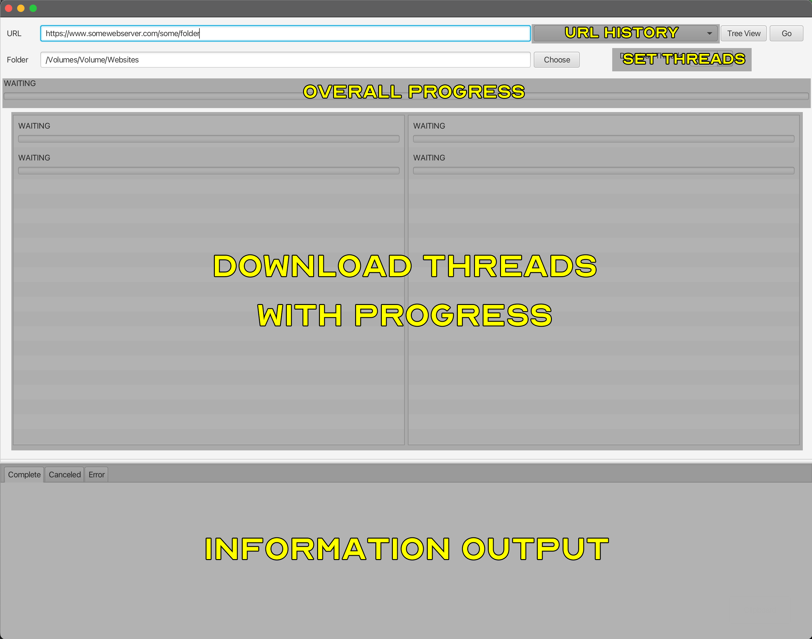
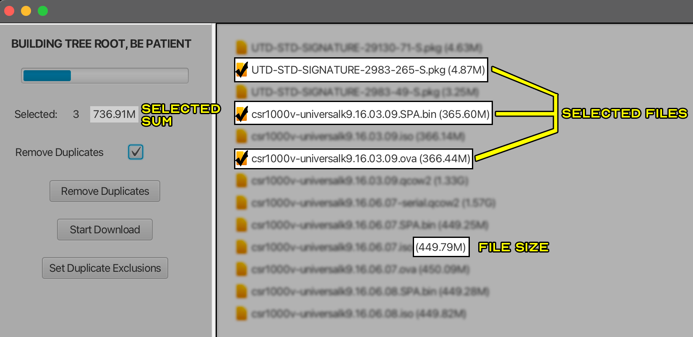

## Syphon

Syphon is a program that allows you to paste in a URL of any folder on a web server and as long as that server has directory listing enabled, then the entire folder tree can be mirrored to your local hard drive, OR, you can pull up a tree view of the folder and its sub folders and pick and choose which files you want to download.

## Installation
Go to the [releases](https://github.com/EasyG0ing1/Syphon/releases) page and download the zip file for your operating system. Windows and Mac will be an installer where Linux offers you the compiled executable. The Java Virtual Machine (JVM) IS NOT REQUIRED to run this program, as it has been compiled into each OS's native-executable using GraalVM.

## More Info
Simply putting in a URL then pressing GO will cause the program to traverse that folder and it will recursively scour all of the folders and subfolders and as it finds files, it will add them to a que where it starts downloading as soon as the first file hits the queue.

The queue submits the jobs to a thread manager which has a max base pool of 20 threads. However, you can change the number of threads from 1 to 20.





When you set a folder for downloading, I recommend creating a folder called something like `Websites` as the program will first create a folder that is the name of the web server you're downloading from (`www.server.com`) then it will create the tree mirror underneath that folder.

The program remembers both the last URL you downloaded as well as your local download path for convenience.

The tabs at the bottom capture the standard and error output from the program and it puts various messages into the related tab categories. (this could use some improvement).

The total progress bar at the top accumulates the size of each file as they are added to the job batch. It can take a little time for file size query to happen since it happens over an http connection. In addition to that, web servers have a limit, apparently, on how large they report a file to be. If the file is over something like 2Gigs, it will report a filesize of 0. So the overall progress bar might not ever be completely accurate, and it will take some time for it to finish receiving all of the file sizes.

Once the job que count at the top of the screen stops counting, then that top progress bar will be as accurate as it's going to be.

What is important to remember is if you get a file where the file size could not be determined because the web server didn't report it correctly, it could look like the progress bar is at 100% while the file is downloading, so just BE PATIENT while the file downloads. You can look at the total download count to know whether or not Syphon is done with all of the downloads.

The **Saved Tree View** and **New Tree View** buttons work like this: Clicking on **New Tree View** will start to build the tree mirror from the web server. If you chose to save the tree view so that you don't have to wait for it to build in the future, you can click on the Save Tree button then the next time you go to that web site, simply click on **Saved Tree View** and it will load that saved tree from disk instead of re-building it from scratch.

You can also add urls so that the drop down list on the first screen always has those URLs in it. Simply make a txt file with each url on its own line, then run the program with the `LinkFile=` argument with the path to the txt file. For example:
```Bash
/Applications/Syphon.app/Contents/MacOS/Syphon LinkFile=~/mylinks.txt
C:\Program Files\Syphon\Syphon\Syphon.exe LinkFile=mylinks.txt
```
The program will save the links into its own location and will use them to populate the drop down list at program launch. You can delete your txt file after the import is complete.

Double-clicking on a folder in the tree view selects all files within that folder. Repeating this will unselect those files.

___
I threw this project together over a weekend, and there are certainly areas that could use improvement, so feel free to create an issue or a pull request if you have any thoughts, concerns or wish to contribute.
